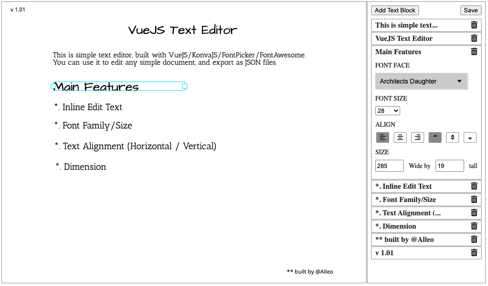

# vuejs-text-editor



## Dependency
```
Vue2
konva, vue-konva
font-picker-vue (google fonts)
fontawesome v5
```

## Files
```
components\
  Editor.vue (main component)
  BlockAttribute.vue (child component of Editor)
```

## Project setup
```
yarn install
```

### Compiles and hot-reloads for development
```
yarn serve
```

### Compiles and minifies for production
```
yarn build
```

### Lints and fixes files
```
yarn lint
```

### Customize configuration
See [Configuration Reference](https://cli.vuejs.org/config/).

Google Fonts Developer API key is hard coded in ```BlockAttribute.vue```.
Please set it up properly.
